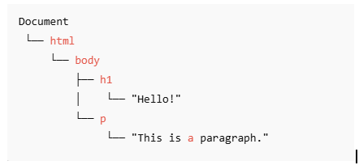

# AltSchool Frontend Circle 5

**Assignment Presentation**

<div @click="$slidev.nav.next" class="mt-12 py-1" hover:bg="white op-10">
  Press Space for next page <carbon:arrow-right />
</div>
---

# Table of Content {.transition-title}

- **<span @click="goToSlide(1)">Front Page</span>**
- **<span @click="goToSlide(2)">Table of Contents</span>**
- **<span @click="goToSlide(3)">Month 1 Week 1</span>**
- **<span @click="goToSlide(7)">Month 1 Week 2</span>**
- **<span @click="goToSlide(10)">Month 1 Week 3</span>**

<script setup>
const goToSlide = (index) => {
  $slidev.nav.go(index)
  }
</script>

<style>
.transition-title {
  color: rgb(0, 255, 0); /* Green color for transition title */
}
span {
  cursor: pointer;
  color: rgb(255, 255, 255);
  text-decoration: none;
}
span:hover {
  color: rgb(16, 24, 235);
}
</style>

---
transition: fade
layout: default
---

# Month 1 – Week 1 Recap {.header-title}

The Second Semester officially kicks off!

## 📚 Recommended Resources {.header-title}
<br>

- [**Learning How to Learn**](https://www.coursera.org/learn/learning-how-to-learn) – Coursera  
- [**The Front End Developer/Engineer Handbook**](https://frontendmasters.com/guides/front-end-handbook/2024/) – Frontend Masters  
- [**Refactoring UI**](https://refactoringui.com/) by Adam Wathan.


<br>


> **Goal:** Master JavaScript before moving on to React.  
> **Semester Expectation:** Build and deploy React applications successfully.

<style>
.header-title {
  color: #3B82F6;
  font-size: 2.5em;
}
</style>
---

ANSWERS TO QUESTIONS (CONCERNS) {.header-title}

## ⚙️ Return Statement in JavaScript {.header-title}

The `return` statement  
- The return statement ends function execution and specifies a value to be called to the function caller.
- The last line in a function must be a return statement.

**Syntax:**
```js
function functionName() {
  return value;
}
```

*The return value can be a variable, array, object, string, number, boolean or even a function.*


<style>
.header-title {
  color: #3B82F6;
  font-size: 2.5em;
}
</style>
---
transition: slide-left
---
**Example:**
```js
function add(a, b) {
  return a + b;
}

let sum = add(3, 5);
console.log(sum); // Output: 8

```

*If return statement is omitted in a function, it returns undefined when called.*

**Example:**
```js
function greet(name) {
console.log("Hello, " + name + "!");
}

let result = greet("Zoe");
console.log(result); // Output: undefined
```
---
transition: slide-left

---

## Ways of Declaring Functions {.header-title} <br>

- **Function Declaration:** A named function is defined with the **'function'** keyword 
```js
function getUsername(user) {
  return user.username;
}
```

- **Function Expression:** A function assigned to a variable
```js
const getUsername = function(user) {
  return user.username;
};
```

- **Arrow Function:** A concise way of writing function expression syntax, introduced in ES6
```js
const getUsername = (user) => {
  return user.username;
};
```

- **One Line Arrow Function(Implicit Return):** Function written on a single line, has implicit return statement.
```js
const getUsername = user => user.username; 
```

---
transition: fade
layout: default
---


<br>

## 🔢 Arrays in Javascript {.header-title}

An array is a data structure used to store multiple comma separated values. Arrays are declared using square brackets,  `[]`. 

*Example:*
```js
let arr = [1, 2, 3]
```

```js
let circleFiveMembers = ["Zoe", "Deborah", "Funmilola", "Augustina", "Angelina", "OgheneO'Tega", "Anthony", "Blessing", "Akanmu", "Arnold", "Kachi", "Omogbolahan"]
console.log(circleFiveMembers[5]) // Output: OgheneO'Tega
```
<br>

*In Javascript, an array can contain different data types.*

**There are several array methods: push(), pop(), shift(), unshift(), map(), filter(), reduce(), sort(), reverse(), slice(), splice().**


<style>
.header-title {
  color: #3B82F6;
  font-size: 2.5em;
}
</style>

---

## 📌 Rest Parameters and Spread Operators{.header-title} 

Rest Parameters represents a concept which allows a function to accept any number of arguments and store in an array. Rest Parameters are used in functions with unknown number of arguments.

Syntax:

 `function myFunction (...args)`

Example:
```js
// function to sum up multiple numbers
function sum(...nums) {
    return nums.reduce((a, b) => a + b, 0);
}

console.log(sum(1, 2, 3)) // Expected Output: 6
```


*It is important to note that only one rest parameter is allowed in a function definition and it must be the last parameter in a function's parameter list.*

<style>
.header-title {
  color: #3B82F6;
  font-size: 2.5em;
}
</style>

---

Spread Operator (`...`) expands an iterable like an array or string into more elements. Iterables are objects that can be looped over especially using the for...of loop.

<br>

```js
const arr = [1, 2, 3];
// Using for of loop
for (const item of arr) {
    console.log(item);
}
// Output: 1 2 3
``` 
<br>

### Spread operator can be used to copy (clone) arrays

```js
let arr = [1, 2, 3];
let newArr = [...arr];
console.log(newArr) // Output: 1, 2, 3
```
---

### Spread operator can be used to merge arrays
<br>
```js
let girls = ["Jane", "Rose", "Blessing"];
let boys = ["John", "David", "Samuel"];
let allStudents = [...girls, ...boys];
console.log(allStudents); // [ "Jane", "Rose", "Blessing", "John", "David", "Samuel"]
```
<br>

### Spread operator can be used to add elements to an array
<br>

```js
const numbers = [1, 2, 3];
const newNumbers = [...numbers, 4]
console.log(newNumbers); // [1, 2, 3, 4]
```

Spread operator can also be used with objects.

---

## 🔁 Callback Functions{.header-title} 

"I will call you back later!"

A callback is a function passed as an argument to another function and gets executed after the completion of a specific task or when an event occurs.

Example
```js
function handleCookies(message, acceptFn, rejectFn) {
    let result = confirm(message);
    // If user clicks 'OK'
    if(result) acceptFn();
    // If user clicks 'Cancel'
    else rejectFn();
}

handleCookies('Do you accept cookies on this site?', 
    () => console.log('Cookies accepted'), 
    () => console.log('Cookies rejected')
);
```

`acceptFn` and `rejectFn` are functions passed as arguments to `handleCookies`. They not executed immediately but called later depending on the user's choice.

<style>
.header-title {
  color: #3B82F6;
  font-size: 2.5em;
}
</style>

---

Callbacks are mostly used in asynchronous operations (tasks running independently)

Example using `setTimeout` function
```js
function showMessage() {
    console.log("Hello after 3 seconds!");
}

setTimeout(showMessage, 3000);
```

`setTimeout` is a built-in asynchronous function in Javascript and it takes in two parameters - a callback function and a delay.

*Note if `showMessage()` is added the function will be executed immediately and return undefined.*

Callbacks are also used in event listeners
```js
document.getElementById('myBtn').addEventListener("click", () => console.log("Button clicked!"))
```

The function (callback) passed as a parameter to `addEventListener` will only be executed when the button is clicked.

---
transition: slide-up
layout: default

---

# Month 1 Week 2 {.header-title}

## PROMISES
1. Pending - initial state
2. Fulfilled - successful completion
3. Rejected - Operation Failed
<br>

### How to create a promise?
Simply: 
```js
newPromise()

```
<br>

**A promise will take the function for the fulfilled and the rejected :**
```js
newPromise(resolve, reject)
```

<br>

Contd on next page


<style>
.header-title {
  color: #10B981;
}
</style>

---
transition: fade-out
layout: two-cols
---
Sample syntax:

```js
Const myPromise = newPromise ((resolve, reject) => {
If () {
resolve(value); // promise is fulfilled with value
} else {
reject(error); // promise is rejected with error
}
});
```
<br>

::right::

Sample Code:
```js
function fetchData(url) {
  return new Promise((resolve, reject) => {
    // Simulating network request
    setTimeout(() => {
      if (url.includes('success')) {
        resolve({ data: 'Here is your data', status: 200 });
      } else {
        reject({ error: 'Failed to fetch data', status: 404 });
      }
    }, 2000);
  });
}

// Using the promise
fetchData('https://api.example.com/success')
  .then(response => {
    console.log('Success:', response.data);
  })
  .catch(error => {
    console.log('Error:', error.error);
  });

```

<style>
.header-title {
  color: #8B5CF6;
}
</style>

---
transition: fade-out
layout: default
---

### Async / Await
It is a Modern way to write Promises

**Note** : Putting 'async' in front of a function automatically makes it a **Promise**.

```js
async function getData() {
  try {
    const response = await fetchData('https://api.example.com/success');
    console.log('Data:', response.data);
    return response;
  } catch (error) {
    console.error('Error:', error);
    throw error;
  }
}

// Call the async function
getData().then(data => {
  console.log('Processing data further');
});
```

<style>
.header-title {
  color: #EC4899;
}
</style>

---
transition: slide-up
layout: default
---

# Month 1 Week 3 {.header-title}

## Text
-  1
-  2
-  3

### Code Example
```js
class Feature {
}
```

<style>
.header-title {
  color: #F59E0B;
}
</style>

---
transition: slide-left
layout: default
---

# Month 1 Week 4 {.header-title}

## BOM, DOM, and CSSOM
<br>

### BOM (Browser Object Model)
<br>

- BOM is the interface between JavaScript and the browser.
- It allows JavaScript to interact with the **browser itself** — such as:
  - The window
  - Tabs
  - URLs
  - Alerts

 <style>
.header-title {
  color: #3B82F6;
  font-size: 2.5em;
}
</style>

---
transition: slide-up
layout: default

---

# CSSOM (CSS Object Model)

- CSSOM is the interface between JavaScript and CSS.
- It allows JavaScript to interact with and **manipulate CSS styles**.
- It's how the browser represents **all the CSS** (from `<style>`, external files, or JavaScript) as an object model.

<style>
.header-title {
  color: #3B82F6;
  font-size: 2.5em;
}
</style>

---
transition: slide-up
layout: default

---

# DOM (Document Object Model)

- DOM is the interface between JavaScript and **HTML + CSS**.
- It represents the web page as an **object tree structure**.
- JavaScript uses the DOM to read, access, and change elements on the page.
- DOM is a **tree-like structure** converted from HTML tags.
- These HTML elements are connected by **nodes** (element nodes, text nodes, etc.).

<style>
.header-title {
  color: #3B82F6;
  font-size: 2.5em;
}
</style>

---
transition: slide-up
layout: default

---

# The Nodes

- The entire HTML document is the **document node**, which is the **root** of the DOM.
- `<html>`, `<body>`, `<h1>`, and `<p>` are **element nodes**.
- `"Hello!"` and `"this is a paragraph"` are **text nodes**.


<style>
.header-title {
  color: #3B82F6;
  font-size: 2.5em;
}
</style>

---
transition: slide-up
layout: two-cols

---
# Example of Nodes Explanation

## Code 
<br>
```html
<!DOCTYPE html>
<html lang="en">
<head>
    <meta charset="UTF-8">
    <meta name="viewport" content="width=device-width, initial-scale=1.0">
    <title>JS DOM</title>
</head>
<body>
    <h1 >Hello!</h1>
    <script>
        document.querySelector("h1").textContent = "New Heading!";
        document.querySelector("h1").style.color = "red";
    </script>
    <p>This is a paragraph.</p>
    <script src="index.js"></script>
    

</body>
</html>
```

::right::
## The nodes


<style>
.header-title {
  color: #3B82F6;
  font-size: 2.5em;
}
</style>

---
transition: slide-up
layout: default

---

# Changing the style the content of an html page

## Code
<br>
```html
<h1 >Hello!</h1>
    <script>
        document.querySelector("h1").textContent = "New Heading!";
        document.querySelector("h1").style.color = "red";
    </script>
    <p>This is a paragraph.</p>
```

<style>
.header-title {
  color: #3B82F6;
  font-size: 2.5em;
}
</style>

---
transition: slide-up
layout: default

---

# Answer to the Assignment question
```js
// creating a div element

const textDiv = document.createElement("div");

// now let's create a paragragh in the div
const textPara = document.createElement("p");

// adding text
textPara.textContent = "See you on the other side, where we will discuss events in JavaScript. May the force be with you.";
textDiv.appendChild(textPara);

document.body.appendChild(textDiv);
textPara.style.fontFamily = 'Georgia', serif;
textPara.style.fontStyle = "italic";
```

<style>
.header-title {
  color: #3B82F6;
  font-size: 2.5em;
}
</style>

---
transition: fade
layout: center
class: text-center
---


# JavaScript Modules and Related Concepts
### WEEK 1 - EXTRA CLASS

---

## 1. Modules and Modularity

**Modularity** refers to breaking down a program into smaller, manageable, and reusable pieces (modules).

<!-- Add a list with staggered animation -->
<v-clicks>

**Why use modularity?**

- Improved code organization
- Easier maintenance and debugging
- Reusability across projects

</v-clicks>

---

<!-- Add fade in animation to code blocks -->
<div v-motion :initial="{ opacity: 0 }" :enter="{ opacity: 1 }">

```javascript
// math.js (module)
export function add(a, b) {
  return a + b;
}

export function subtract(a, b) {
  return a - b;
}
```
<br>

```javascript
// app.js (main file)
import { add, subtract } from "./math.js";
```

</div>

## <!-- Add slide transitions -->

<br>

## 2. Bundlers

<!-- Add click animations to list items -->
<v-clicks>

**Popular bundlers:**

- Webpack
- Rollup
- Vite
- Parcel

</v-clicks>

---

### Why use bundlers?

- Support for modular code in environments that don't support modules natively.
- Code splitting and optimization (tree-shaking, minification).

<br>

### Webpack Example (Conceptual):

<br>

```javascript
// index.js
import { greet } from "./utils.js";

greet("World");
```
<br>

```javascript
// utils.js
export function greet(name) {
  console.log(`Hello, ${name}!`);
}
```

---

## 3. Imports and Exports

### a) Named Export/Import

```javascript
// math.js
export function add(a, b) {
  return a + b;
}
export function subtract(a, b) {
  return a - b;
}
```

```javascript
// app.js
import { add, subtract } from "./math.js";
```
<br>

### b) Renamed Exports/Imports

```javascript
// math.js
function add(a, b) {
  return a + b;
}
export { add as sum };
```

```javascript
// app.js
import { sum as addNumbers } from "./math.js";
```
---

### c) Default Export/Import

<br>

```javascript
// logger.js
export default function log(message) {
  console.log(message);
}
```

<br>

```javascript
// app.js
import log from "./logger.js";
```

<br>

### d) Dynamic Import

<br>

```javascript
// app.js
button.addEventListener("click", async () => {
  const module = await import("./math.js");
  console.log(module.add(2, 3));
});
```

---

## 4. ESM (ECMAScript Modules)

**ESM** is the standardized module system for JavaScript (using `import`/`export`). It’s supported in modern browsers and Node.js.

### Enabling ESM in Node.js:

You can:

- Use the `.mjs` file extension **or**
- Add `"type": "module"` in `package.json`

<br>

```json
// package.json
{
  "type": "module"
}
```
---

### Example:

<br>
<br>

```javascript
// utils.mjs or utils.js (with type module in package.json)
export const greet = (name) => `Hello, ${name}!`;
```

<br>

```javascript
// main.mjs or main.js
import { greet } from "./utils.mjs";
console.log(greet("ESM"));
```

---

## 5. Package.json

The `package.json` file is the configuration file for Node.js projects. It defines:

- Project metadata (name, version, description)
- Dependencies and devDependencies
- Scripts for running tasks
- Module type (CommonJS or ESM)
- Entry points (e.g., `main`, `module`)

---

### Example:

<br>

```json
{
  "name": "my-project",
  "version": "1.0.0",
  "description": "A sample project demonstrating modules",
  "type": "module",
  "main": "index.js",
  "scripts": {
    "start": "node index.js",
    "build": "webpack"
  },
  "dependencies": {
    "lodash": "^4.17.21"
  },
  "devDependencies": {
    "webpack": "^5.0.0"
  }
}
```
---

# Month 2 Week 1 {.header-title}

## Cont. of DOM in JavaScript (Selecting an Element by Its Unique Identifier (Id) and Styling It Within JavaScript)

### Summary:

DOM (also known as **Document Object Model**) is the object representation of HTML.  
An HTML document could be declared with an empty body.  
The **Id** of each empty element node can then be selected using `querySelector` or `getElementById`.  
The `innerHTML` can then be assigned a value after a variable has been declared.  
The selected elements can be styled as preferred within the JavaScript code.

---

### Example of a Document with an Empty Body

```html
<!DOCTYPE html>
<html lang="en">
  <head>
    <meta charset="UTF-8" />
    <meta name="viewport" content="width=device-width, initial-scale=1.0" />
    <script src="./index.js" defer></script>
    <title>Dom in JavaScript</title>
  </head>
  <body>
    <div id="container">
    <h1 id="circle_5"></h1>
    <p id="semester_2"></p>
</div>
  </body>
</html>
```
<br>
### Example of Selecting an Element by Its Unique Identifier (Id) Using `querySelector` and `getElementById`, and Styling the Selected Elements...

---

You can select HTML elements by their unique `id` using either `querySelector` or `getElementById`. After selection, you can modify their content and apply styles directly with JavaScript.

```js
//Selecting elements by id using the querySelector
const divElement = document.getElementById("container");
const h1Element = document.querySelector("#circle_5");
const h2Element = document.getElementById("semester_2");
//throw an error if elements are not found
if (h1Element === null) {
};
if (h2Element === null) {
}
//If found, display these messages into the inner text and style it
divElement.style =
  "Justify-content: center; text-align: center; background-color: #f7f7f7; padding: 20px; margin: 20px 0; border: 1px solid #ccc;border-radius: 15px;";
h1Element.innerHTML = "Altschool FrontEnd Circle-5";
h2Element.innerHTML =
  "Summary of what we have learnt since the beginning of 2nd semester.";
  ```
---
  
  # Thank You! {.thank-you}

## Questions & Discussion

<style>
.thank-you {
  background: linear-gradient(45deg, #4EC5D4 10%, #146b8c 20%);
  -webkit-background-clip: text;
  -moz-background-clip: text;
  -webkit-text-fill-color: transparent;
  -moz-text-fill-color: transparent;
  font-size: 3em;
}
</style>

---