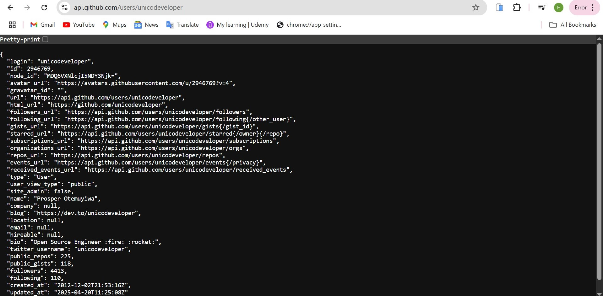

# AltSchool Frontend Circle 5

**Assignment Presentation**

<div @click="$slidev.nav.next" class="mt-12 py-1" hover:bg="white op-10">
  Press Space for next page <carbon:arrow-right />
</div>
---

# Table of Content {.transition-title}

- **<span @click="goToSlide(1)">Front Page</span>**
- **<span @click="goToSlide(2)">Table of Contents</span>**
- **<span @click="goToSlide(3)">Month 1 Week 1</span>**
- **<span @click="goToSlide(7)">Month 1 Week 2</span>**
- **<span @click="goToSlide(10)">Month 1 Week 3</span>**

<script setup>
const goToSlide = (index) => {
  $slidev.nav.go(index)
  }
</script>

<style>
.transition-title {
  color: rgb(0, 255, 0); /* Green color for transition title */
}
span {
  cursor: pointer;
  color: rgb(255, 255, 255);
  text-decoration: none;
}
span:hover {
  color: rgb(16, 24, 235);
}
</style>

---
transition: fade
layout: default
---

# Month 1 – Week 1 Recap {.header-title}

The Second Semester officially kicks off!

## 📚 Recommended Resources {.header-title}
<br>

- **Learning How to Learn** – Coursera  
- **The Front End Developer/Engineer Handbook** – Frontend Masters  
- **Refactoring UI** by Adam Wathan.


<br>


> **Goal:** Master JavaScript before moving on to React.  
> **Semester Expectation:** Build and deploy React applications successfully.

<style>
.header-title {
  color: #3B82F6;
  font-size: 2.5em;
}
</style>
---

ANSWERS TO QUESTIONS (CONCERNS) {.header-title}

## ⚙️ Return Statement in JavaScript {.header-title}

The `return` statement  
- The return statement ends function execution and specifies a value to be called to the function caller.
- The last line in a function must be a return statement.

**Syntax:**
```js
function functionName() {
  return value;
}
```

*The return value can be a variable, array, object, string, number, boolean or even a function.*

**Example:**
```js
function add(a, b) {
  return a + b;
}

let sum = add(3, 5);
console.log(sum); // Output: 8

```


<style>
.header-title {
  color: #3B82F6;
  font-size: 2.5em;
}
</style>
---
transition: slide-left
---
*If return statement is omitted in a function, it returns undefined when called.*

**Example:**
```js
function greet(name) {
console.log("Hello, " + name + "!");
}

let result = greet("Zoe");
console.log(result); // Output: undefined
```

## Ways of Declaring Functions {.header-title}

There are several ways of creating functions in Javascript:<br>

- **Function Declaration:** A named function is defined with the **'function'** keyword 
```js
function getUsername(user) {
  return user.username;
}
```
<br>

-**Function Expression:** A function assigned to a variable
```js
const getUsername = function(user) {
  return user.username;
};
```


<style>
.header-title {
  color: #3B82F6;
}
</style>

---
transition: fade
layout: default
---

- **Arrow Function:** A concise way of writing function expression syntax, introduced in ES6.
```js
const getUsername = (user) => {
  return user.username;
};
```
- **One Line Arrow Function (Implicit Return):**  Function written on a single line, has implicit return statement.
```js
const getUsername = user => user.username; 
```
<br>

## Arrays in Javascript {.header-title}

An array is a data structure used to store multiple comma separated values. Arrays are declared using square brackets, []. 

*Example:*
```js
let arr = [1, 2, 3]
```

```js
let circleFiveMembers = ["Zoe", "Deborah", "Funmilola", "Augustina", "Angelina", "OgheneO'Tega", "Anthony", "Blessing", "Akanmu", "Arnold", "Kachi"]
console.log(circleFiveMembers[5]) // Output: OgheneO'Tega
```
<br>

*In Javascript, an array can contain different data types.*

**There are several array methods: push(), pop(), shift(), unshift(), map(), filter(), reduce(), sort(), reverse(), slice(), splice().**


<style>
.header-title {
  color: #3B82F6;
  font-size: 2.5em;
}
</style>

---
transition: slide-up
layout: default
---

# Month 1 Week 2 {.header-title}

## PROMISES
1. Pending - initial state
2. Fulfilled - successful completion
3. Rejected - Operation Failed
<br>

### How to create a promise?
Simply: 
```js
newPromise()

```
<br>

**A promise will take the function for the fulfilled and the rejected :**
```js
newPromise(resolve, reject)
```

<br>

Contd on next page


<style>
.header-title {
  color: #10B981;
}
</style>

---
transition: fade-out
layout: two-cols
---
Sample syntax:

```js
Const myPromise = newPromise ((resolve, reject) => {
If () {
resolve(value); // promise is fulfilled with value
} else {
reject(error); // promise is rejected with error
}
});
```
<br>

::right::

Sample Code:
```js
function fetchData(url) {
  return new Promise((resolve, reject) => {
    // Simulating network request
    setTimeout(() => {
      if (url.includes('success')) {
        resolve({ data: 'Here is your data', status: 200 });
      } else {
        reject({ error: 'Failed to fetch data', status: 404 });
      }
    }, 2000);
  });
}

// Using the promise
fetchData('https://api.example.com/success')
  .then(response => {
    console.log('Success:', response.data);
  })
  .catch(error => {
    console.log('Error:', error.error);
  });

```

<style>
.header-title {
  color: #8B5CF6;
}
</style>

---
transition: fade-out
layout: default
---

### Async / Await
It is a Modern way to write Promises

**Note** : Putting 'async' in front of a function automatically makes it a **Promise**.

```js
async function getData() {
  try {
    const response = await fetchData('https://api.example.com/success');
    console.log('Data:', response.data);
    return response;
  } catch (error) {
    console.error('Error:', error);
    throw error;
  }
}

// Call the async function
getData().then(data => {
  console.log('Processing data further');
});
```

<style>
.header-title {
  color: #EC4899;
}
</style>

---
transition: slide-up
layout: default
---

# Month 1 Week 3 {.header-title}

## API’S AND ITS FUNCTION

###  SUMMARY: { .hhh }


- The primary responsibility of a front end developer is to create pixel perfect UI and also 
  to make the UI functional and usable.   
- API’s are endpoints to Github.There is always a documentation on every API.
- You can make use of Github API to create a repository,and also use it to comment
- **FETCH**is used to make API’S calls.Making API’s calls is like you are talking to a particular backend/ endpoint.
- **XMLHttpRequest** can also be used to make API calls
- API’s are also used to submit forms.
- There are different ways to talk to the API’s  which are : **GET**, **POST**.

<style>
.header-title {
  color: #F59E0B;
}

.hhh{
    color:green;
  }
</style>

--- 
transition: slide-left
---

 **GET**
 
 This is a single way to fetch information back to us.Example of the GET request is when you visit a browser.

  


---
transition: fade-out
layout: default
---

**POST**

 Basically means to send  the browser an information to get back another information.
 the browser cannot make a POST request as a first request inside a URL tab especially.

 A very good example of POST is when you fill a form or sign up by inputting your name,address,email and other data and submit,then you log in and it returns a feedback which indicates that your information has been received. i.e a token, which can further be sent to another API called USERS.Then the `Headers` must be parsed in using the token which is encrypted with the user’s details. This confirms that its the same user registered that is logged in.

 ## Code 
```js
Const response = await fetch (‘/api/users’ {
    method : ‘POST’,
headers : {
 ‘content-Type’ : ‘application/json’,
  }
body : JSON.stringify (user) ,
  })
const  result = await response.json ()

```

--- 
transition: slide-up
layout: full
---
The code above shows the process using method POST and we get something called `headers` which is the ‘content-type’ called **AUTHORIZATION(BEARER)**.

 
Encryption and Decryption is used to store and reveal user ID using a form of token either cookies or local storage,session etc.
Backend must have a documentation for the frontend to rely on by providing API’s to communicate with.They are the intermediary between frontend and the database.
There are several tools that can give us the same interface of API’s, example is the **Github API Docs**.They can be used to create repositories using tokens.

 # URLs
Javascript provides a built in URL class that makes working with URL easier and safer.The URL object provides a convenient method to parse in URLs.

<style>
.header-title {
  color: #10B981;
}
</style>

---

## Code

```js
const url = new URL("https://example.com/products?id=123&category=books");

console.log(url.href);        // "Full URL: "https://example.com/products?id=123&category=books"
console.log(url.origin);      // "https://example.com"
console.log(url.protocol);    // "https:"
console.log(url.hostname);    // "example.com"
console.log(url.pathname);    // "/products"
console.log(url.search);      // "?id=123&category=books"
console.log(url.hash);        // "" (empty if not present)
console.log(url.searchParams.get("id"));       // "123"
console.log(url.searchParams.get("category")); // "books"

url.searchParams.set("category", "fiction");   // Update parameter
url.searchParams.append("sort", "price");      // Add new parameter
url.searchParams.delete("id");             // Remove a parameter

console.log(url.toString()); // New URL after changes

const newUrl = new URL("https://example.com/page");
newUrl.searchParams.set("user", "alice");
newUrl.searchParams.set("mode", "edit");

console.log(newUrl.toString()); 
// Output: "https://example.com/page?user=alice&mode=edit"
```

--- 

There are API's used to generate token and auntheticate ID's.We have **WEATHER API'S**,**JSONPLACEHOLDER**.
There is an npm package called **JSONSERVER** used to create API'S when there is no API that meets 
our needs by creating a fake data that looks like JSON.


# TOPICS 
- MODULES & JAVASCRIPT IN THE BROWSER(DOM)
- IMPORT & EXPORT (Why do they exist?)
- WHAT IS DOM?


---

# Month 1 Week 4 {.header-title}

## Documentation

::right::

## Code
```js
const final = {
}
```

<style>
.header-title {
  color: #EF4444;
}
</style>

transition: fade
layout: center
class: text-center


---

# Thank You! {.thank-you}

## Questions & Discussion

<style>
.thank-you {
  background: linear-gradient(45deg, #4EC5D4 10%, #146b8c 20%);
  -webkit-background-clip: text;
  -moz-background-clip: text;
  -webkit-text-fill-color: transparent;
  -moz-text-fill-color: transparent;
  font-size: 3em;
}
</style>

---
transition: fade-out
layout: default
---
